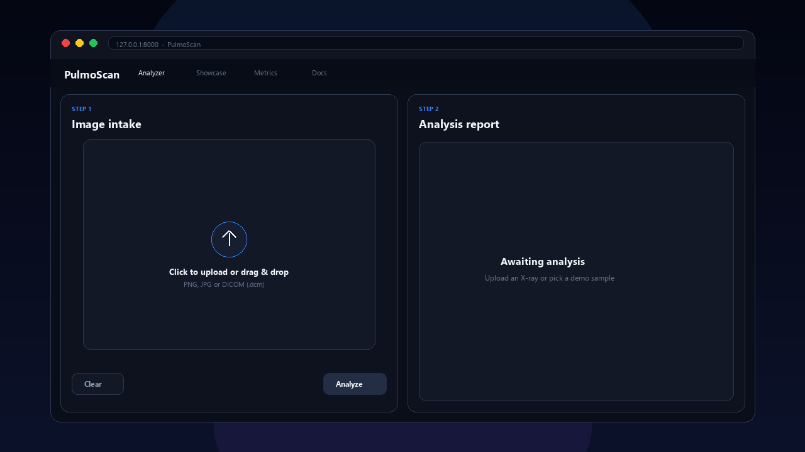
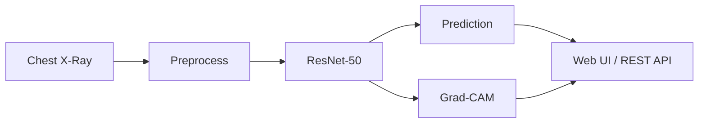

<div align="center">

# PulmoScan

**AI-powered chest X-ray pneumonia detection with explainable Grad-CAM, uncertainty scoring, and a production-ready web app.**

[](https://www.python.org/)
[](https://pytorch.org/)
[](https://fastapi.tiangolo.com/)
[](LICENSE)
[](.github/workflows/ci.yml)

[Features](#-features) · [Demo](#-demo) · [Quick Start](#-quick-start) · [Web App](#-web-app) · [API](#-api-reference) · [Training](#-training) · [Docker](#-docker)

</div>

---

## Demo

<p align="center">
  
</p>

<p align="center">
  <strong>Hero showcase</strong> &nbsp;·&nbsp; <strong>Image intake</strong> &nbsp;·&nbsp; <strong>Grad-CAM</strong> &nbsp;·&nbsp; <strong>Analysis report</strong>
</p>

<p align="center">
  <a href="#-quick-start"><strong>Start analysis →</strong></a>
  &nbsp;&nbsp;|&nbsp;&nbsp;
  <a href="#-web-app"><strong>Web app features</strong></a>
</p>

<details>
<summary><strong>Update this demo</strong> (screen recording or regenerate)</summary>

1. Run <code>chestxray serve</code> and record the live UI (<kbd>Win</kbd>+<kbd>G</kbd> on Windows).
2. Replace <code>docs/demo.gif</code> with your recording.
3. Or regenerate to match the bundled UI: <code>python scripts/generate_readme_demo.py</code>

</details>

---

> **Disclaimer:** This project is for **research and education only**. It is **not a medical device** and must not be used for clinical diagnosis or treatment decisions.

---

## Overview

**PulmoScan** is an end-to-end medical imaging pipeline that classifies chest X-rays as **NORMAL** or **PNEUMONIA** using a fine-tuned **ResNet-50**. It goes beyond a notebook demo: installable Python package, unified CLI, FastAPI service, interactive web UI, Grad-CAM explainability, and production-minded features (DICOM, uncertainty, audit logs, PDF reports).



| | |
|---|---|
| **Model** | ResNet-50 (ImageNet) + custom head, two-phase fine-tuning |
| **Dataset** | [Chest X-Ray Pneumonia](https://www.kaggle.com/datasets/paultimothymooney/chest-xray-pneumonia) (Kaggle) |
| **Test accuracy** | ~90–94% (full training run) |
| **Explainability** | Grad-CAM heatmaps + overlay |
| **Serving** | FastAPI + single-page web app |

---

## Features

### Core ML
- Transfer learning with **staged fine-tuning** (frozen head → full backbone)
- **Class-weighted loss** + label smoothing for imbalanced data
- **Stratified validation split** (replaces the dataset's tiny 16-image val set)
- **Balanced-accuracy** checkpoint selection
- **Test-time augmentation** (`tta=true` at inference)

### Clinical trust & workflow
- **Grad-CAM** — see *which regions* drove the prediction
- **MC-Dropout uncertainty** — entropy + abstention when the model is unsure
- **OOD input guard** — flags non-radiograph uploads (color photos, etc.)
- **DICOM (`.dcm`) support** via `pydicom`
- **PDF reports**, **audit log**, and **feedback loop** for corrections

### Engineering
- Installable package (`pip install -e .`) with unified **`chestxray` CLI**
- **FastAPI** REST API + polished **PulmoScan web UI** (light/dark theme)
- **Docker**, **GitHub Actions CI**, **pytest** suite, **pre-commit** hooks
- Env-based config (`.env.example`)

---

## Quick Start

### 1. Clone & install

```bash
git clone https://github.com/Yash-Singh607/pulmoscan.git
cd pulmoscan

python -m venv venv
# Windows
venv\Scripts\activate
# macOS / Linux
source venv/bin/activate

pip install -e ".[dev,serve,data]"
```

### 2. Download data (Kaggle)

1. Create a [Kaggle](https://www.kaggle.com) account → **Account → API → Create New Token**
2. Place `kaggle.json` in `~/.kaggle/` (Linux/macOS) or `%USERPROFILE%\.kaggle\` (Windows)
3. Run:

```bash
chestxray setup-data
```

### 3. Train (or quick demo)

```bash
# Full run — target >90% test accuracy (GPU recommended)
chestxray train --epochs 15 --batch-size 32

# Quick CPU smoke test (~2 min, demo quality only)
chestxray train --epochs 2 --limit 300 --batch-size 16
```

### 4. Launch the app

```bash
chestxray serve --host 127.0.0.1 --port 8000
```

Open **[http://127.0.0.1:8000](http://127.0.0.1:8000)** — upload an X-ray, view predictions, Grad-CAM, and export reports.

---

## Hospital workflow (prototype)

PulmoScan includes a **hospital-shaped workflow** for research demos (not certified for clinical use):

| Capability | Description |
|------------|-------------|
| **Case management** | De-identified patient refs + study metadata (`POST /cases`) |
| **Image quality gate** | Blur/exposure checks before trusting results |
| **Clinical triage** | `routine` · `review` · `reject` on every study |
| **Review queue** | Flagged studies queue for radiologist agree/disagree |
| **FHIR export** | `GET /studies/{id}/fhir` → DiagnosticReport bundle |
| **Async jobs** | `POST /jobs/analyze` → poll `GET /jobs/{id}` |
| **Model registry** | `GET /models` lists checkpoint versions |
| **Observability** | `GET /ready`, `GET /metrics/prometheus`, `X-Request-ID` tracing |
| **JWT auth + RBAC** | Enable with `CXR_JWT_SECRET` (roles: viewer, clinician, admin) |

See **[MODEL_CARD.md](MODEL_CARD.md)** for intended use, limitations, and safety notes.

---

## Web App

The bundled **PulmoScan** UI includes:

| Capability | Description |
|------------|-------------|
| Single & batch mode | Analyze one image or many at once (CSV export) |
| Grad-CAM | Heatmap + adjustable overlay opacity, click-to-zoom |
| Threshold slider | Tune pneumonia cutoff live (sensitivity tuning) |
| Uncertainty advisory | Flags low-confidence / borderline / abstained cases |
| DICOM upload | Clinical `.dcm` files alongside PNG/JPG |
| PDF report | One-click downloadable analysis report |
| Audit history | Server-side log of recent predictions |
| Feedback | 👍 / 👎 to record corrections for retraining |
| Live metrics | Performance section reads `outputs/metrics.json` after training |

> Requires a trained checkpoint at `checkpoints/best_model.pth` (override with `CXR_CHECKPOINT_PATH`).

---

## API Reference

Interactive docs: **`http://127.0.0.1:8000/docs`**

| Method | Endpoint | Description |
|--------|----------|-------------|
| `GET` | `/` | Web UI |
| `GET` | `/health` | Health check |
| `GET` | `/metadata` | Model classes, device, checkpoint path |
| `GET` | `/metrics` | Latest training metrics (`outputs/metrics.json`) |
| `GET` | `/metrics/errors` | Misclassified test samples (after training) |
| `GET` | `/history` | Recent predictions (audit log) |
| `POST` | `/predict` | Classify image/DICOM (+ OOD check) |
| `POST` | `/predict/analyze` | Prediction + Grad-CAM + uncertainty |
| `POST` | `/predict/report` | PDF report download |
| `POST` | `/feedback` | Submit correct/incorrect feedback |

```bash
curl -X POST http://127.0.0.1:8000/predict/analyze \
  -F "file=@data/chest_xray/test/PNEUMONIA/person1_bacteria_1.jpeg"
```

Optional: `POST /predict?tta=true` for test-time augmentation.  
Optional auth: set `CXR_API_KEYS` (comma-separated); send `X-API-Key` header.

---

## Training

### Strategy

| Phase | Epochs | What trains |
|-------|--------|-------------|
| 1 | 1 → unfreeze−1 | Classification head only (backbone frozen) |
| 2 | unfreeze → end | Full ResNet-50 at 10× lower LR |

**Default recipe (tuned for >90% accuracy):**

- Stratified 15% validation split from train (`resplit_val`)
- Balanced-accuracy model selection
- Class weights + label smoothing (`0.05`)
- Augmentation: random crop, flip, rotation, affine, color jitter

```bash
chestxray train --profile high-accuracy --data-dir data/chest_xray
```

After training, metrics include calibration (`temperature`, `optimal_threshold`) and `outputs/error_analysis.json` for misclassified test samples.

| Flag | Default | Description |
|------|---------|-------------|
| `--profile` | `default` | Use `high-accuracy` for mixup, SWA, 256px, TTA eval |
| `--epochs` | `20` | Training epochs |
| `--batch-size` | `32` | Batch size |
| `--lr` | `1e-3` | Initial learning rate |
| `--unfreeze-epoch` | `6` | When to unfreeze backbone |
| `--val-split` | `0.15` | Validation fraction from train |
| `--label-smoothing` | `0.05` | Label smoothing factor |
| `--limit` | — | Cap images/split (quick smoke runs) |

### Expected results

| Metric | Approx. range |
|--------|----------------|
| Test accuracy | 90–94% |
| F1 | 0.93–0.95 |
| ROC-AUC | 0.95–0.99 |

Metrics, confusion matrix, and ROC curve are saved to `outputs/`.

### Architecture

```
ResNet-50 (ImageNet pretrained)
  └── Backbone
        └── fc → Dropout(0.4) → Linear(2048→256) → ReLU → Dropout(0.3) → Linear(256→2)
```

---

## Dataset

**Chest X-Ray Images (Pneumonia)** — Paul Mooney · [Kaggle](https://www.kaggle.com/datasets/paultimothymooney/chest-xray-pneumonia) · CC BY 4.0

| Split | NORMAL | PNEUMONIA | Total |
|-------|--------|-----------|-------|
| Train | 1,341 | 3,875 | 5,216 |
| Val *(shipped)* | 8 | 8 | 16 |
| Test | 234 | 390 | 624 |

> PulmoScan re-splits validation from train by default — the shipped val folder is too small for reliable model selection.

---

## Project Structure

```
pulmoscan/
├── chestxray/           # Core package
│   ├── api.py           # FastAPI app + web UI mount
│   ├── cli.py           # Unified CLI
│   ├── engine.py        # Training loop
│   ├── inference.py     # Classifier + Grad-CAM + uncertainty
│   ├── gradcam.py       # Grad-CAM implementation
│   ├── imaging.py       # DICOM + OOD guard
│   ├── audit.py         # Audit log + feedback store
│   ├── report.py        # PDF report builder
│   └── web/             # Frontend (HTML/CSS/JS)
├── tests/               # Pytest suite
├── docs/                # README demo GIF, poster, and frame assets
├── scripts/             # Utility scripts (e.g. generate_readme_demo.py)
├── pyproject.toml       # Packaging & tool config
├── Dockerfile
├── .github/workflows/   # CI
└── .env.example         # Environment template
```

Large artifacts (`data/`, `checkpoints/`, `outputs/`) are gitignored — download data and train locally.

---

## CLI

```bash
chestxray setup-data          # Download Kaggle dataset
chestxray eda                 # Exploratory analysis → outputs/eda/
chestxray train               # Train model → checkpoints/best_model.pth
chestxray predict --image x.jpg   # Inference + Grad-CAM overlay
chestxray export-feedback     # Export corrections for fine-tuning
chestxray release             # Bundle checkpoint + metrics for GitHub Release
chestxray serve --port 8000   # Start API + web UI
```

Legacy entry points (`python train.py`, etc.) remain as thin wrappers.

---

## Docker

```bash
docker build -t pulmoscan:latest .
docker run --rm -p 8000:8000 \
  -v "$(pwd)/checkpoints:/app/checkpoints" \
  pulmoscan:latest
```

CPU-only image with healthcheck on port `8000`.

### Docker Compose (SQLite persistence)

```bash
docker compose up --build
```

Mounts `checkpoints/`, `outputs/`, and enables durable SQLite storage (`CXR_STORE=sqlite`).

### Deploy (Render)

Use the included [`render.yaml`](render.yaml) blueprint. Upload `best_model.pth` via a release asset or persistent disk before going live.

---

## Release weights

After training, bundle artifacts for GitHub Releases:

```bash
chestxray release --out release_bundle
# Upload release_bundle/best_model.pth + metrics.json as release assets
```

---

## Configuration

Copy `.env.example` → `.env` or export variables:

| Variable | Purpose |
|----------|---------|
| `CXR_DATA_DIR` | Dataset root |
| `CXR_CHECKPOINT_PATH` | Model loaded by API |
| `CXR_OUTPUT_DIR` | Metrics, plots, audit logs |
| `CXR_STORE` | `jsonl` or `sqlite` (durable persistence) |
| `CXR_SQLITE_PATH` | SQLite database path when `CXR_STORE=sqlite` |
| `CXR_MC_PASSES` | MC-Dropout passes (`0` = off) |
| `CXR_API_KEYS` | API keys (empty = auth disabled) |
| `CXR_RATE_LIMIT` | Requests/min/IP (`0` = off) |
| `CXR_NUM_WORKERS` | DataLoader workers (`0` on Windows) |

---

## Testing

```bash
pip install -e ".[dev]"
pytest
pytest --cov=chestxray
ruff check chestxray tests
pre-commit install
```

CI runs lint + tests on Python 3.9 and 3.11 via GitHub Actions.

---

## Troubleshooting

| Issue | Fix |
|-------|-----|
| `No module named 'kaggle'` | `pip install kaggle` |
| CUDA OOM | `chestxray train --batch-size 16` |
| Dataset not found | Run `chestxray setup-data` first |
| Windows DataLoader errors | Default `num_workers=0`; increase only if stable |
| Push from wrong directory | `cd` into project root before `pip install -e .` |

---

## Tech Stack

Python · PyTorch · TorchVision · OpenCV · FastAPI · Uvicorn · Pydicom · Matplotlib · pytest · Ruff · Docker · GitHub Actions

---

## Author

**Yash Singh** · [GitHub @Yash-Singh607](https://github.com/Yash-Singh607)

---

